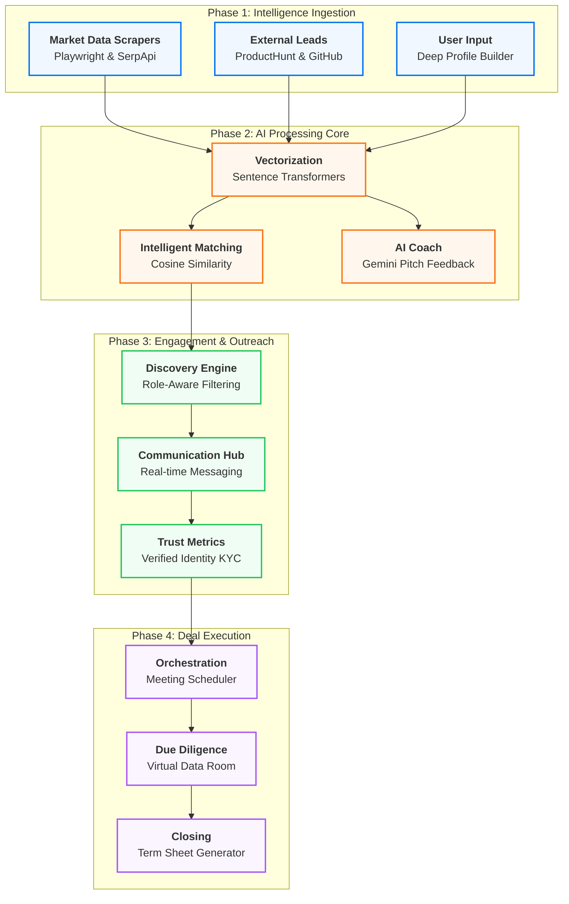
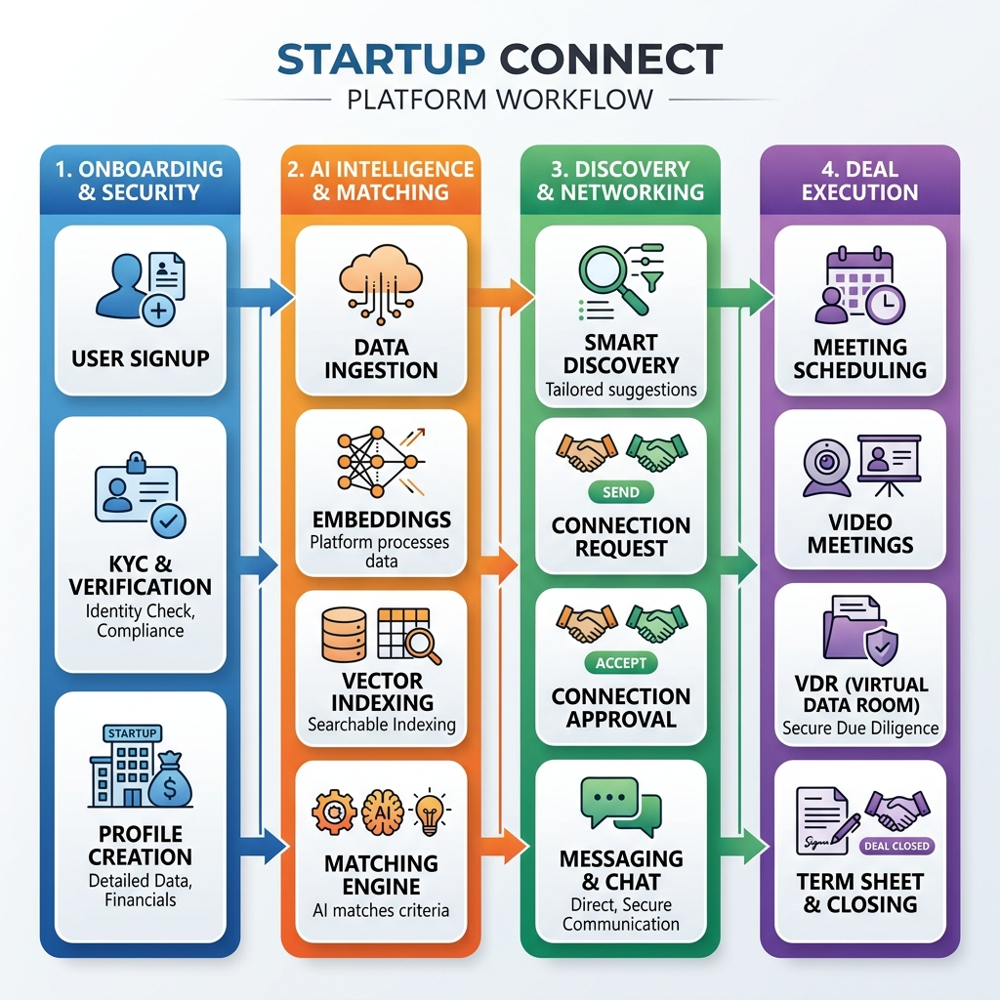

# 🚀 Startup Connect

<div align="center">


**The institutional-grade platform connecting startups with investors.**  
Discover · Connect · Collaborate · Close Deals

[](https://nextjs.org/)
[](https://nodejs.org/)
[](https://mongodb.com/)
[](https://fastapi.tiangolo.com/)
[](https://redis.io/)
[](https://www.typescriptlang.org/)

</div>

---

## 🆕 Recent Updates (April 2026)

### 📱 Premium Mobile Experience
- **Strategic UI Overhaul**: Implemented a high-fidelity design system mirroring the web platform's "Institutional" aesthetic.
- **Multi-Step Registration**: Added a streamlined 3-step onboarding (Profile -> Role -> OTP Verification).
- **Secure Authentication**: Integrated real-time **OTP verification** via backend services for institutional security.
- **Android Optimization**: Fixed host-loopback connectivity issues for Android emulators (10.0.2.2).

### 📰 Market Intelligence Hub
- **Automated Ingestion**: Real-time scraping of news, events, and grants using Playwright and SerpApi.
- **AI Summarization**: Intelligent digest generation using Google Gemini to provide actionable market insights.
- **Grant Pipeline**: Automated matching of startup profiles to newly ingested grant opportunities.

### 🛡️ Institutional Security & Infrastructure
- **MFA & Verified Identities**: Enhanced KYC verification and Multi-Factor Authentication via Twilio.
- **Stabilized Environment**: Resolved version mismatches and bundling errors in the React Native New Architecture (Fabric).

---

## 📋 Table of Contents

1. [Overview](#-overview)
2. [Architecture](#-architecture)
3. [Methodology](#-methodology)
4. [Workflow](#-workflow)
5. [Tech Stack](#-tech-stack)
6. [Project Structure](#-project-structure)
7. [Features](#-features)
8. [Getting Started](#-getting-started)
9. [Environment Variables](#-environment-variables)
10. [API Reference](#-api-reference)
11. [Database Models](#-database-models)
12. [Deployment](#-deployment)
13. [Docker Setup](#-docker-setup)
14. [Contributing](#-contributing)

---

## 🌟 Overview

**Startup Connect** is a full-stack, production-ready platform designed for the Indian startup ecosystem. It bridges the gap between early-stage startups and institutional investors through intelligent matching, real-time communication, and streamlined deal management.

### Who is this for?

| Role | What they can do |
|------|-----------------|
| **Startups** | Discover investors, pitch digitally, schedule meetings, manage deals, track analytics |
| **Investors** | Screen startups, build portfolios, conduct due diligence via VDR, close term sheets |
| **Admins** | Manage users, monitor platform health, verify identities (KYC), control billing |

---

## 🏗️ Architecture

```
┌─────────────────────────────────────────────────────────────────┐
│                        Client Layer                             │
│   Next.js 16 (App Router) + TypeScript + TailwindCSS v4        │
│   Real-time: Socket.IO Client                                   │
└──────────────────────────┬──────────────────────────────────────┘
                           │ HTTPS / WS
┌──────────────────────────▼──────────────────────────────────────┐
│                     Backend API Layer                           │
│   Node.js + Express.js (ESM)   PORT: 5000                      │
│   Auth: JWT + Passport.js (Google OAuth, LinkedIn OAuth)       │
│   Real-time: Socket.IO Server                                  │
│   Queue: BullMQ + Redis                                        │
│   Security: Helmet, Rate Limiting, XSS-Clean, HPP             │
└────────────┬─────────────────────────────┬──────────────────────┘
             │                             │
┌────────────▼──────────┐    ┌────────────▼────────────┐
│     MongoDB Atlas     │    │     AI Microservice      │
│   Primary Database    │    │   Python + FastAPI       │
│   Mongoose ODM        │    │   PORT: 8000             │
│   29 Data Models      │    │   Sentence Transformers  │
└───────────────────────┘    │   Google Gemini / OpenAI │
                             └─────────────────────────┘
             │
┌────────────▼──────────┐
│     Redis             │
│   Session Cache       │
│   Job Queue (BullMQ)  │
│   Rate Limiting       │
└───────────────────────┘

External Services:
  ├─ Cloudinary (Media Storage)
  ├─ AWS S3 (Pitch Deck PDFs)
  ├─ Stripe (Billing / Subscriptions)
  ├─ Twilio (SMS / MFA)
  ├─ Nodemailer / Gmail SMTP (Email)
  ├─ Google Meet / Zoom / MS Teams (Meetings)
  ├─ SurePass (KYC Verification)
  └─ ProductHunt / GitHub / Apify (Data Ingestion)
```

---

## 📊 Methodology

Startup Connect employs a multi-tiered methodology to facilitate seamless startup-investor interactions, moving from data-driven intelligence to secure deal finalization.



---

## 🔄 Workflow

The comprehensive user journey and data flow within the Startup Connect ecosystem, illustrating the transition from onboarding to deal finalization.

```mermaid
flowchart LR
    %% Onboarding
    subgraph Onboarding [1. Onboarding & Security]
        direction TB
        A[User Signup] --> B[KYC Verification]
        B --> C[Profile Optimization]
    end

    %% AI Pipeline
    subgraph AI_Pipeline [2. AI Intelligence Pipeline]
        direction TB
        C --> D[Embeddings Generation]
        D --> E[Vector Indexing]
        E --> F[Compatibility Scoring]
    end

    %% Engagement
    subgraph Engagement [3. Discovery & Networking]
        direction TB
        F --> G[Smart Discovery]
        G --> H[Connection Request]
        H --> I[Socket.io Chat]
    end

    %% Execution
    subgraph Execution [4. Deal Execution]
        direction TB
        I --> J[Meeting Scheduler]
        J --> K[Secure VDR Access]
        K --> L[Term Sheet Generator]
    end

    %% Connections
    Onboarding ==> AI_Pipeline
    AI_Pipeline ==> Engagement
    Engagement ==> Execution

    %% Styling
    style Onboarding fill:#eff6ff,stroke:#3b82f6,stroke-width:2px,stroke-dasharray: 5 5
    style AI_Pipeline fill:#fff7ed,stroke:#f97316,stroke-width:2px,stroke-dasharray: 5 5
    style Engagement fill:#f0fdf4,stroke:#22c55e,stroke-width:2px,stroke-dasharray: 5 5
    style Execution fill:#fdf4ff,stroke:#d946ef,stroke-width:2px,stroke-dasharray: 5 5
    
    linkStyle default stroke:#64748b,stroke-width:2px
```



<div align="center">
  
</div>

---

## 🛠️ Tech Stack

### Frontend (`/web`)
| Technology | Version | Purpose |
|------------|---------|---------|
| **Next.js** | 16.1.1 | React framework with App Router |
| **React** | 19.2.3 | UI library |
| **TypeScript** | 5.x | Type safety |
| **TailwindCSS** | 4.x | Utility-first styling |
| **Radix UI** | Latest | Headless accessible UI primitives |
| **Zustand** | 5.x | Global state management |
| **Socket.IO Client** | 4.x | Real-time communication |
| **Framer Motion** | 12.x | Animations |
| **Recharts** | 3.x | Data visualization |
| **React Hook Form** | 7.x | Form management |
| **Zod** | 4.x | Schema validation |
| **Sonner** | 2.x | Toast notifications |
| **Lucide React** | 0.562 | Icon library |

### Backend (`/backend`)
| Technology | Version | Purpose |
|------------|---------|---------|
| **Node.js** | 20.x | Runtime (ESM modules) |
| **Express.js** | 4.x | HTTP framework |
| **MongoDB** | 7.x | Primary database |
| **Mongoose** | 9.x | ODM |
| **Socket.IO** | 4.x | WebSockets |
| **BullMQ** | 5.x | Job queue (background tasks) |
| **Redis (ioredis)** | 5.x | Cache + queue broker |
| **Passport.js** | 0.7 | OAuth (Google, LinkedIn) |
| **JWT** | 9.x | Authentication tokens |
| **Stripe** | 22.x | Payment processing |
| **Twilio** | 5.x | SMS / communications |
| **Nodemailer** | 7.x | Email delivery |
| **Google APIs** | 171.x | Google Meet / Calendar |
| **Cloudinary** | 1.x | Media (images, logos) |
| **AWS S3 SDK** | 3.x | Pitch deck storage |
| **Pino** | 10.x | Structured logging |
| **Joi / Zod** | Latest | Request validation |
| **Helmet** | 8.x | HTTP security headers |
| **node-cron** | 4.x | Scheduled tasks |

### AI Service (`/ai-service`)
| Technology | Purpose |
|------------|---------|
| **FastAPI** | Python REST API framework |
| **Sentence Transformers** | Text embedding generation |
| **scikit-learn** | ML algorithms for matching |
| **Google Generative AI** | Gemini model integration |
| **OpenAI** | GPT integration |
| **PyMuPDF** | PDF parsing (pitch decks) |
| **pandas / numpy** | Data processing |

### Mobile App (`/mobile`)
| Technology | Version | Purpose |
|------------|---------|---------|
| **Expo** | 55.x | React Native managed framework |
| **React Native** | 0.83.6 | Native mobile framework (New Arch / Fabric) |
| **React Navigation** | 7.x | Stack, Tab, and Drawer navigation |
| **Lucide React Native** | 0.563 | Premium icon system |
| **Reanimated** | 4.x | Gesture-based fluid animations |
| **Async Storage** | 2.2 | Local data persistence |
| **Socket.IO Client** | 4.8 | Real-time institutional messaging |
| **WebRTC** | 124.x | Peer-to-peer video/audio protocols |
| **Google Fonts (Inter)** | Latest | Strategic typography system |

---

## 📁 Project Structure

```
startup-connect/
├── web/                          # Next.js Frontend
│   ├── app/
│   │   ├── dashboard/
│   │   │   ├── page.tsx          # Main dashboard (role-aware)
│   │   │   ├── discover/         # Startup & Investor discovery
│   │   │   ├── saved/            # ✨ Saved Items collection
│   │   │   ├── network/          # Connections & networking
│   │   │   ├── chat/             # Real-time messaging
│   │   │   ├── meetings/         # Meeting scheduler
│   │   │   ├── deals/            # Deal pipeline
│   │   │   ├── pitch/            # Pitch deck upload
│   │   │   ├── vdr/              # Virtual Data Room
│   │   │   ├── pipeline/         # Investment pipeline
│   │   │   ├── portfolio/        # Investor portfolio
│   │   │   ├── term-sheet/       # Term sheet generator
│   │   │   ├── ai-coach/         # AI pitch coach
│   │   │   ├── settings/         # User settings
│   │   │   └── settings-premium/ # Premium plan settings
│   │   ├── login/                # Authentication
│   │   ├── register/             # Sign up
│   │   ├── onboarding/           # Role-based onboarding
│   │   ├── billing/              # Subscription management
│   │   ├── investor/             # Investor public profiles
│   │   ├── startup/              # Startup public profiles
│   │   ├── messages/             # Messaging shortcut
│   │   ├── meetings/             # Meetings shortcut
│   │   ├── settings/             # Settings shortcut
│   │   ├── calendar/             # Calendar view
│   │   ├── admin/                # Admin panel
│   │   └── page.tsx              # Landing page
│   ├── components/
│   │   ├── layout/
│   │   │   ├── DashboardLayout.tsx
│   │   │   ├── Sidebar.tsx
│   │   │   └── Navbar.tsx
│   │   ├── ui/                   # Radix-based UI components
│   │   ├── SaveButton.tsx        # ✨ Universal bookmark button
│   │   ├── CommandPalette.tsx    # Cmd+K command palette
│   │   ├── TrustRadar.tsx        # Trust score visualization
│   │   ├── ai/                   # AI coach components
│   │   ├── cards/                # Reusable card components
│   │   ├── discover/             # Discovery UI
│   │   ├── meetings/             # Meeting components
│   │   ├── notifications/        # Notification system
│   │   └── pitch/                # Pitch deck components
│   ├── lib/
│   │   ├── api.ts                # API fetch wrapper (retry, cache, auth)
│   │   └── store.ts              # Zustand auth store
│   └── hooks/                    # Custom React hooks
│
├── backend/                      # Node.js API
│   └── src/
│       ├── server.js             # Entry point (Socket.IO + HTTP)
│       ├── app.js                # Express app, middleware, routes
│       ├── models/               # 29 Mongoose data models
│       ├── controllers/          # Business logic (29 controllers)
│       ├── routes/               # Express route definitions
│       ├── middleware/            # Auth, rate limit, upload
│       ├── services/             # External service integrations
│       ├── sockets/              # Socket.IO event handlers
│       ├── config/               # DB, logger, passport, env
│       ├── scripts/              # DB setup, embeddings, seeding
│       ├── scrapers/             # Data ingestion scrapers
│       ├── utils/                # Helpers, AppError, validators
│       └── validations/          # Joi/Zod request validators
│
├── ai-service/                   # Python FastAPI Microservice
│   ├── main.py                   # FastAPI app, endpoints
│   ├── engine.py                 # AI matching & recommendation engine
│   └── scrapers/                 # Python-based scrapers
│
├── mobile/                       # React Native (Expo) - Premium Mobile App
│   ├── src/
│   │   ├── screens/
│   │   │   ├── LoginScreen.tsx       # Premium "Hi Again" UI
│   │   │   ├── RegisterScreen.tsx    # Multi-step (Info -> Role -> OTP)
│   │   │   ├── DiscoverScreen.tsx    # Deal & Startup discovery
│   │   │   └── ChatScreen.tsx        # Real-time messaging
│   │   ├── context/
│   │   │   └── AuthContext.tsx       # JWT + OTP Auth management
│   │   └── navigation/
│   │       └── AppNavigator.tsx      # Stack & Tab navigation
│   ├── App.tsx                       # Root component with Theme/Auth
│   └── app.json                      # Expo configuration (SDK 55)
│
├── docker-compose.yml            # Multi-service Docker setup
├── render.yaml                   # Render.com deployment blueprint
└── .env.example                  # Environment variable template
```

---

## ✨ Features

### 🔐 Authentication & Security
- **JWT-based auth** with refresh token rotation
- **OAuth 2.0** — Google Sign-In, LinkedIn Sign-In
- **Role-Based Access Control** — `startup`, `investor`, `admin`
- **E-KYC Verification** (SurePass API) — PAN, Aadhaar, GST
- **MFA** via Twilio SMS OTP
- **Rate limiting**, XSS protection, HPP, MongoDB sanitization
- **Session management** with Redis

### 👤 User Onboarding
- Role-aware onboarding flow (startup vs investor)
- Profile builder with industry, stage, focus area selection
- Avatar upload via Cloudinary
- Public profile with claim verification

### 🔍 Discovery Engine
- **Startup discovery** — filter by industry, stage, funding, location
- **Investor discovery** — filter by investment focus, ticket size, portfolio
- **External leads** — ingested from ProductHunt, GitHub, external sources
- Smart pagination + infinite scroll
- Outreach system with daily quota enforcement (20/day)

### 🤖 AI Matching System
- **Sentence Transformer embeddings** for all startup/investor profiles
- **Cosine similarity matching** via Python AI service
- **AI Coach** — Gemini-powered pitch improvement feedback
- **Smart match scores** displayed in dashboard and discovery
- AI-powered recommendations on the Saved Items page
- Profile embedding auto-generation via background cron

### 📌 Saved Items (Bookmarking)
- Save startups, investors, and meetings to a personal collection
- **Pin** items to the top of the list
- **Favorite** items with star marking
- **Real-time search** — name, industry, bio, tags
- **Sort** — recently saved, oldest, pinned first
- **Grid & List view** toggle
- **Export** collection as CSV or JSON
- **Empty state** with CTA to explore
- Stats dashboard (total, pinned, favorites by type)
- Recently Viewed integration
- AI Recommendations section

### 📰 Market Intelligence Hub (New ✨)
- **Real-time ingestion** of news, events, and grants from 40+ trusted sources.
- **AI-driven summarization** for quick institutional insights.
- **Grant discovery pipeline** — automatically matched to startup profiles.
- **Event tracking** — never miss a networking opportunity.
- **Market trends** — visualized in the dashboard.

### 💬 Real-time Messaging
- Socket.IO powered chat rooms
- Conversation threading
- Read receipts and delivery status
- Emoji reactions
- File and media sharing

### 📅 Meeting System
- Schedule meetings via **Google Meet**, **Zoom**, or **Microsoft Teams**
- OAuth token management for all three providers
- Instant meeting creation or scheduled booking
- Calendar integration + `.ics` file export
- Cancellation and reschedule request flows
- Email notifications via Nodemailer

### 🤝 Connection Management
- Send / accept / reject connection requests
- Pending state management
- Network graph of connections
- Smart duplicate prevention

### 💼 Deal Pipeline
- Kanban-style deal tracking
- Deal stage progression (Intro → Due Diligence → Term Sheet → Closed)
- Notes and file attachments per deal

### 📄 Virtual Data Room (VDR)
- Secure document uploads (AWS S3)
- Access-controlled document sharing
- Pre-signed URL generation for secure downloads
- Document versioning

### 📊 Analytics
- Startup analytics (profile views, match rate, outreach stats)
- Investor analytics (portfolio performance, deal metrics)
- Platform-wide admin analytics

### 💳 Billing & Subscriptions
- **Stripe** integration for subscription plans
- Free / Starter / Pro / Enterprise tiers
- Webhook processing for subscription events
- Usage metering and quota enforcement

### 🔔 Notifications
- In-app notification system
- Email notifications for key events
- Real-time push via Socket.IO

### 🛡️ Admin Panel
- User management (ban, verify, role change)
- Platform analytics dashboard
- KYC verification queue
- Data ingestion management
- Report handling

---

## 🚀 Getting Started

### Prerequisites

Make sure you have the following installed:

| Tool | Version | Purpose |
|------|---------|---------|
| **Node.js** | ≥ 20.x | Backend & frontend runtime |
| **npm** | ≥ 10.x | Package manager |
| **Python** | ≥ 3.10 | AI microservice |
| **pip** | Latest | Python package manager |
| **MongoDB** | Atlas or local 7.x | Primary database |
| **Redis** | ≥ 7.x | Cache and job queue |
| **Git** | Any | Version control |

---

### 1. Clone the Repository

```bash
git clone https://github.com/your-org/startup-connect.git
cd startup-connect
```

---

### 2. Configure Environment Variables

```bash
cp .env.example .env
```

Open `.env` and fill in all required values. See the [Environment Variables](#-environment-variables) section for a full breakdown.

---

### 3. Install Backend Dependencies

```bash
cd backend
npm install
```

---

### 4. Install Frontend Dependencies

```bash
cd ../web
npm install
```

---

### 5. Set Up AI Service

```bash
cd ../ai-service

# Create and activate virtual environment
python -m venv venv

# Windows
venv\Scripts\activate

# macOS / Linux
source venv/bin/activate

# Install dependencies
pip install -r requirements.txt
```

---

### 6. Set Up Database Indexes

```bash
cd ../backend
npm run setup-indexes
```

---

### 7. Generate AI Embeddings (optional, for matching)

```bash
npm run embeddings
```

---

### 8. Start All Services

Open **three separate terminals**:

**Terminal 1 — Backend API**
```bash
cd backend
npm run dev
# → Running on http://localhost:5000
```

**Terminal 2 — Frontend**
```bash
cd web
npm run dev
# → Running on http://localhost:3000
```

**Terminal 3 — AI Service**
```bash
cd ai-service
source venv/bin/activate   # or venv\Scripts\activate on Windows
python main.py
# → Running on http://localhost:8000
```

---

### 9. Visit the App

| Service | URL |
|---------|-----|
| Frontend | http://localhost:3000 |
| Backend API | http://localhost:5000 |
| API Health | http://localhost:5000/health |
| AI Service | http://localhost:8000 |

---

## 🔧 Environment Variables

Copy `.env.example` to `.env` and configure the following:

### Core Backend

```env
NODE_ENV=development
PORT=5000
BACKEND_URL=http://localhost:5000
FRONTEND_URL=http://localhost:3000

# Generate with: node -e "console.log(require('crypto').randomBytes(64).toString('hex'))"
JWT_SECRET=<64-char-random-string>
SESSION_SECRET=<64-char-random-string>
ENCRYPTION_KEY=<32-char-string>
```

### Database

```env
MONGO_URI=mongodb+srv://<user>:<password>@cluster.mongodb.net/startup-connect
```

> 💡 Use [MongoDB Atlas](https://www.mongodb.com/atlas) for a free cloud database.

### Redis

```env
REDIS_URL=redis://:password@host:6379
```

> 💡 Use [Redis Cloud](https://redis.com/redis-enterprise-cloud/) for a free hosted instance.

### AI Services

```env
OPENAI_API_KEY=sk-...
GEMINI_API_KEY=AIza...
AI_SERVICE_URL=http://127.0.0.1:8000
```

### OAuth (Social Login)

```env
# Google OAuth - https://console.cloud.google.com
GOOGLE_CLIENT_ID=xxx.apps.googleusercontent.com
GOOGLE_CLIENT_SECRET=GOCSPX-xxx

# LinkedIn OAuth - https://www.linkedin.com/developers
LINKEDIN_CLIENT_ID=xxx
LINKEDIN_CLIENT_SECRET=xxx
```

### Email (Gmail SMTP)

```env
EMAIL_SERVICE=gmail
EMAIL_USER=your@gmail.com
EMAIL_PASS=your-16-char-app-password    # Gmail App Password (not your account password)
EMAIL_FROM="Startup Connect" <your@gmail.com>
```

> 💡 Enable [Gmail App Passwords](https://myaccount.google.com/apppasswords) with 2FA turned on.

### AWS S3 (Pitch Decks)

```env
AWS_ACCESS_KEY_ID=AKIA...
AWS_SECRET_ACCESS_KEY=...
AWS_REGION=ap-south-1
AWS_S3_BUCKET=startup-connect-pitch-decks
```

### Cloudinary (Media/Logos)

```env
# Add to .env (not in .env.example by default)
CLOUDINARY_CLOUD_NAME=your-cloud-name
CLOUDINARY_API_KEY=your-api-key
CLOUDINARY_API_SECRET=your-api-secret
```

### Stripe (Billing)

```env
STRIPE_SECRET_KEY=sk_test_...
STRIPE_WEBHOOK_SECRET=whsec_...
```

### KYC Verification

```env
VERIFICATION_API_BASE_URL=https://sandbox.surepass.io/api/v1
VERIFICATION_API_KEY=your-surepass-token
```

### Data Ingestion

```env
PRODUCTHUNT_TOKEN=your-ph-token
GITHUB_TOKEN=ghp_...
```

### Frontend

```env
NEXT_PUBLIC_API_URL=http://localhost:5000
```

---

## 📡 API Reference

All API endpoints are prefixed with `/api`. All protected routes require:
```
Authorization: Bearer <JWT_TOKEN>
```

### Authentication

| Method | Endpoint | Description |
|--------|----------|-------------|
| `POST` | `/api/auth/register` | Register new user |
| `POST` | `/api/auth/login` | Login, returns JWT |
| `POST` | `/api/auth/logout` | Logout, invalidate session |
| `POST` | `/api/auth/forgot-password` | Send password reset email |
| `POST` | `/api/auth/reset-password` | Reset password with token |
| `GET`  | `/api/auth/google` | Google OAuth initiate |
| `GET`  | `/api/auth/google/callback` | Google OAuth callback |
| `GET`  | `/api/auth/linkedin` | LinkedIn OAuth initiate |
| `GET`  | `/api/auth/linkedin/callback` | LinkedIn OAuth callback |

### Saved Items ✨

| Method | Endpoint | Auth | Description |
|--------|----------|------|-------------|
| `GET`  | `/api/save` | ✅ | Get saved items (supports `?sort=`, `?type=`, `?search=`, `?page=`) |
| `POST` | `/api/save` | ✅ | Toggle save/unsave an item |
| `DELETE` | `/api/save/:id` | ✅ | Remove a saved item by save record ID |
| `PUT` | `/api/save/:id/favorite` | ✅ | Toggle favorite status |
| `PUT` | `/api/save/:id/pin` | ✅ | Toggle pinned status |
| `GET`  | `/api/save/stats` | ✅ | Get counts (total, startups, investors, etc.) |
| `GET`  | `/api/save/export` | ✅ | Export all saved items as JSON |
| `GET`  | `/api/save/recent` | ✅ | Get recently viewed items |
| `POST` | `/api/save/recent` | ✅ | Track a recently viewed item |
| `GET`  | `/api/save/watchlist` | ✅ | Get user's watchlists |
| `POST` | `/api/save/watchlist` | ✅ | Create a new watchlist |
| `POST` | `/api/save/watchlist/:id/add` | ✅ | Add item to a watchlist |

### Discovery

| Method | Endpoint | Auth | Description |
|--------|----------|------|-------------|
| `GET`  | `/api/discover/startups` | ✅ | Discover startups with filters |
| `GET`  | `/api/discover/investors` | ✅ | Discover investors with filters |
| `GET`  | `/api/discover/external` | ✅ | External leads (ProductHunt, GitHub) |
| `POST` | `/api/discover/outreach` | ✅ | Send outreach (20/day limit) |

### Users

| Method | Endpoint | Auth | Description |
|--------|----------|------|-------------|
| `GET`  | `/api/users/me` | ✅ | Get current user profile |
| `PUT`  | `/api/users/me` | ✅ | Update profile |
| `GET`  | `/api/users/stats` | ✅ | Get dashboard stats |
| `POST` | `/api/users/avatar` | ✅ | Upload profile picture |

### Meetings

| Method | Endpoint | Auth | Description |
|--------|----------|------|-------------|
| `POST` | `/api/meetings` | ✅ | Create a meeting |
| `GET`  | `/api/meetings` | ✅ | Get user's meetings |
| `GET`  | `/api/meetings/:id` | ✅ | Get single meeting |
| `PUT`  | `/api/meetings/:id` | ✅ | Update meeting |
| `POST` | `/api/meetings/:id/cancel` | ✅ | Request cancellation |
| `POST` | `/api/meetings/:id/reschedule` | ✅ | Request reschedule |

### Connections

| Method | Endpoint | Auth | Description |
|--------|----------|------|-------------|
| `POST` | `/api/connections/request` | ✅ | Send connection request |
| `PUT`  | `/api/connections/:id/accept` | ✅ | Accept connection |
| `PUT`  | `/api/connections/:id/reject` | ✅ | Reject connection |
| `GET`  | `/api/connections` | ✅ | Get all connections |

### Messages

| Method | Endpoint | Auth | Description |
|--------|----------|------|-------------|
| `GET`  | `/api/messages/conversations` | ✅ | Get all conversations |
| `GET`  | `/api/messages/:conversationId` | ✅ | Get messages in conversation |
| `POST` | `/api/messages` | ✅ | Send a message |

### AI Coach

| Method | Endpoint | Auth | Description |
|--------|----------|------|-------------|
| `POST` | `/api/ai/analyze-pitch` | ✅ | Analyze pitch deck with AI |
| `POST` | `/api/ai/recommend` | ✅ | Get AI-powered recommendations |

### Matching

| Method | Endpoint | Auth | Description |
|--------|----------|------|-------------|
| `GET`  | `/api/match/me` | ✅ | Get top matches for current user |
| `POST` | `/api/match/generate` | ✅ | Trigger match recalculation |

### Billing

| Method | Endpoint | Auth | Description |
|--------|----------|------|-------------|
| `POST` | `/api/billing/checkout` | ✅ | Create Stripe checkout session |
| `POST` | `/api/billing/portal` | ✅ | Open Stripe customer portal |
| `POST` | `/api/billing/webhook` | ❌ | Stripe webhook handler |

---

## 🗄️ Database Models

The platform uses **29 Mongoose models** in MongoDB:

| Model | Collection | Purpose |
|-------|-----------|---------|
| `User` | users | Core user identity, auth, role, avatar |
| `Startup` | startups | Startup profiles with funding, industry, team info |
| `Investor` | investors | Investor profiles with portfolio, focus, ticket size |
| `Meeting` | meetings | Meeting records with provider, participants, status |
| `Saved` | saveds | Bookmarked items (startups, investors, meetings) |
| `RecentlyViewed` | recentlyvieweds | Recently viewed entity tracking |
| `Watchlist` | watchlists | Curated watchlists of entities |
| `Connection` | connections | Connection request/acceptance records |
| `Conversation` | conversations | Chat conversation rooms |
| `Message` | messages | Individual chat messages |
| `Match` | matches | AI-computed compatibility scores |
| `ProfileEmbedding` | profileembeddings | Vector embeddings for AI matching |
| `Deal` | deals | Deal pipeline entries |
| `VDRDocument` | vdrdocuments | Virtual Data Room documents |
| `CalendarEvent` | calendarevents | Calendar entries |
| `Notification` | notifications | In-app notifications |
| `Subscription` | subscriptions | Stripe subscription records |
| `Lead` | leads | External lead data (ProductHunt, GitHub) |
| `ExternalStartup` | externalstartups | Ingested startup data |
| `ExternalInvestor` | externalinvestors | Ingested investor data |
| `ExternalProfile` | externalprofiles | Generic external profiles |
| `OutreachLog` | outreachlogs | Outreach action logs + quota tracking |
| `UserInteraction` | userinteractions | Behavioral tracking |
| `Report` | reports | User-submitted reports |
| `Campaign` | campaigns | Marketing campaigns |
| `AnalyticsStartup` | analyticsstartups | Startup-specific analytics |
| `AnalyticsInvestor` | analyticsinvestors | Investor-specific analytics |
| `Usage` | usages | Feature usage metering |
| `Event` | events | Platform events log |

---

## 🚢 Deployment

### Render.com (Recommended)

The project includes a `render.yaml` blueprint for one-click deployment.

```bash
# Install Render CLI
npm install -g @render-com/cli

# Deploy
render blueprint apply
```

Services deployed:
- `startup-connect-api` — Node.js backend (port 5000)
- `startup-connect-ai` — Python AI service (port 8000)

> **Note:** Deploy the frontend separately on **Vercel** for optimal Next.js performance.

### Vercel (Frontend)

```bash
cd web
npx vercel --prod
```

Set the following environment variable in Vercel:
```
NEXT_PUBLIC_API_URL=https://your-backend-url.onrender.com
```

---

## 🐳 Docker Setup

For local development with Docker Compose:

```bash
# Start all services (MongoDB, Redis, Backend, AI Service)
docker-compose up -d

# Stop services
docker-compose down

# View logs
docker-compose logs -f backend

# Rebuild after code changes
docker-compose up -d --build
```

Services started:
| Service | Port |
|---------|------|
| Backend API | 5000 |
| AI Service | 8000 |
| MongoDB | 27017 |
| Redis | 6379 |

> **Note:** The Next.js frontend is not included in docker-compose — run it separately with `npm run dev` in `/web`.

---

## 📱 Mobile App (Strategic Connect)

The mobile application is a high-performance **React Native (Expo)** app designed for "on-the-go" institutional networking.

### Latest Features:
- **Premium UI/UX**: High-fidelity design mirroring the web application with Inter 900+ typography and high-contrast branding.
- **Strategic Auth**: Multi-step registration flow including real-time **OTP verification** via backend integration.
- **Institutional Gateway**: Role-aware interface for Founders and Investors.
- **Android Ready**: Optimized for Android emulators with pre-configured host-loopback connectivity.

### Running Mobile:
```bash
cd mobile
npm install
npx expo start --android
```

---

## 🔄 Background Jobs

The platform runs several scheduled background tasks:

| Job | Schedule | Description |
|-----|----------|-------------|
| **Data Ingestion** | Every 12 hours | Scrapes ProductHunt, GitHub, external sources for new startup/investor data |
| **Embedding Generation** | On-demand | Generates vector embeddings for AI matching |
| **Cleanup** | On server start | Cleans up stale temporary files |

---

## 🧪 Useful NPM Scripts

### Backend

```bash
npm run dev          # Start dev server with nodemon
npm run start        # Start production server
npm run embeddings   # Generate AI vector embeddings
npm run setup-indexes # Create MongoDB indexes
npm run validate     # Validate all environment variables
```

### Frontend

```bash
npm run dev          # Start Next.js dev server
npm run build        # Build for production
npm run start        # Start production server
npm run lint         # Run ESLint
```

---

## 🔒 Security Checklist

- [x] JWT with short expiry + refresh rotation
- [x] Bcrypt password hashing (10 rounds)
- [x] Helmet — HTTP security headers
- [x] Rate limiting (500 req/min general, 100/15min auth)
- [x] XSS-Clean middleware
- [x] HPP (HTTP Parameter Pollution) protection
- [x] MongoDB sanitization (prevent NoSQL injection)
- [x] CORS restricted to allowed origins in production
- [x] Environment secrets never committed (`.env` in `.gitignore`)
- [x] Pre-signed S3 URLs (never expose bucket directly)
- [x] Stripe webhook signature verification
- [x] Input validation on all routes (Joi / Zod)

---

## 🐛 Troubleshooting

### "Cannot connect to MongoDB"
- Verify `MONGO_URI` in `.env` is correct
- Ensure your IP is whitelisted in MongoDB Atlas → Network Access

### "Redis connection refused"
- Make sure Redis is running: `redis-server` or use Redis Cloud
- Check `REDIS_URL` format: `redis://[:password@]host[:port]`

### "401 Unauthorized on API calls"
- Token may have expired — log out and log back in
- Verify `JWT_SECRET` is the same between restarts

### "AI matching not working"
- Ensure the Python AI service is running on port 8000
- Check `AI_SERVICE_URL=http://127.0.0.1:8000` in `.env`
- Run `npm run embeddings` to generate profile embeddings first

### "Email not sending"
- Use a Gmail **App Password** (not your account password)
- Enable 2FA on Gmail first, then generate an App Password

### Port already in use
```bash
# Windows — find and kill process on port 5000
netstat -ano | findstr :5000
taskkill /PID <PID> /F

# macOS/Linux
lsof -i :5000
kill -9 <PID>
```

---

## 🤝 Contributing

1. **Fork** the repository
2. **Create** a feature branch: `git checkout -b feature/your-feature`
3. **Commit** your changes: `git commit -m "feat: add your feature"`
4. **Push** to the branch: `git push origin feature/your-feature`
5. Open a **Pull Request**

### Commit Convention

Follow [Conventional Commits](https://www.conventionalcommits.org/):

```
feat:     New feature
fix:      Bug fix
docs:     Documentation only
style:    Formatting, no logic change
refactor: Code refactor
perf:     Performance improvement
test:     Adding tests
chore:    Build process, tooling
```

---

## 📄 License

This project is licensed under the **ISC License**. See [LICENSE](./LICENSE) for details.

---

## 👨‍💻 Team

Built with ❤️ by the **Startup Connect Team** — connecting India's next generation of founders and investors.

---

<div align="center">

**[🌐 Live Demo](https://startupconnect.app)** · **[📧 Contact](mailto:support@startupconnect.app)** · **[🐛 Report Bug](https://github.com/your-org/startup-connect/issues)**

</div>
